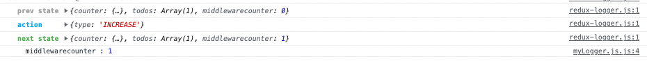

# 리덕스 미들웨어
리덕스 미들웨어는 리덕스가 지니고 있는 핵심 기능입니다. Context API 또는 MobX를 사용하는것과 차별화가 되는 부분이죠. 리덕스 미들웨어를 사용하면 액션이 디스패치 된 다음, 리듀서에서 해당 액션을 받아와서 업데이트하기 전에 추가적인 작업을 할 수 있습니다. 보통 리덕스에서 미들웨어를 사용하는 주된 사용 용도는 비동기 작업을 처리 할 때 입니다. 일반적으로는 리덕스 미들에웨어 라이브러리를 설치하여 사용합니다. 비동기 작업에 관련된 미들웨어 라이브러리는 redux-thunk, redux-saga, redux-observable, redux-promise-middleware 등이 있습니다.

- redux-thunk
- redux-saga

## redux-saga와 redux-observable
redux-saga와 redux-observable의 경우엔 특정 액션을 모니터링 할 수도 있으므로, 특정 액션이 디스패치됐을때 원하는 함수를 호출하거나, 또는 라우터를 통해 다른 주소로 이동하는 것이 가능합니다.

## redux-thunk
redux-thunk는 리덕스에서 비동기 작업을 처리 할 때 가장 많이 사용하는 미들웨어입니다. 이 미들웨어를 사용하면 액션 객체가 아닌 함수를 디스패치 할 수 있습니다. redux-thunk는 리덕스의 창시자인 Dan Abramov가 만들었으며, 리덕스 공식 매뉴얼에서도 비동기 작업을 처리하기 위하여 미들웨어를 사용하는 예시를 보여줍니다.

# 미들웨어 만들어보고 이해하기
사실 실무에서는 리덕스 미들웨어를 직접 만들게 되는 일은 거의 없습니다. 그러나 민들어 본다면 어떤 역할인지 쉽게 이해 할 수 있습니다. 미들웨어는 결국 하나의 함수입니다. 함수를 연달아서 두번 리턴하는 함수죠. 
미들웨어 안에서는 무엇이든지 할 수 있습니다. 예를 들어서 액션 값을 객체가 아닌 함수도 받아오게 만들어서 액션이 함수타입이면 이를 실행시키게끔 할 수도 있습니다 (이게 우리가 추후 배워볼 redux-thunk 입니다).

```javascript 
function middleware(store) {
  return function (next) {
    return function (action) {
      // 하고 싶은 작업...
    };
  };
};

// 이를 줄이면 이렇게 표현할 수 있습니다. 
const middleware = store => next => action => {
  // 하고 싶은 작업
}
```

첫째, `store` : 리덕스 스토어 인스턴스입니다. 이 안에 dispatch, getState, subscribe 내장함수들이 들어있죠.
둘째, `next` : 액션을 다음 미들웨어에게 전달하는 함수입니다. next(action) 이런 형태로 사용합니다. 만약 다음 미들웨어가 없다면 리듀서에게 액션을 전달해줍니다. 만약에 next 를 호출하지 않게 된다면 액션이 무시처리되어 리듀서에게로 전달되지 않습니다.
셋째, `action` : 현재 처리하고 있는 액션 객체입니다.

### redux-logger 
 Redux에서 사용되는 미들웨어(middleware) 중 하나로, 액션(action)과 상태(state)의 변화를 콘솔(console)에 출력해주는 도구입니다. Redux 애플리케이션을 디버깅할 때 유용하게 사용됩니다. redux-logger를 사용하면, Redux Store의 dispatch 메서드를 호출할 때마다 발생하는 모든 액션의 정보(타입, 페이로드)와 액션 처리 후의 상태 변화를 콘솔에 출력할 수 있습니다. 이를 통해 언제, 어떤 액션이 발생했는지, 그에 따라 상태가 어떻게 변경되었는지 확인할 수 있습니다. redux-logger는 미들웨어(middleware)로써 applyMiddleware 함수를 사용하여 Redux Store에 적용할 수 있습니다. 애플리케이션에서 액션이 발생할 때마다 redux-logger가 콘솔에 로그를 출력할 것입니다.

 - ex-middleware : ex-middleware에서는 라이브러리 없이 구축하였다. 

 ### redux-logger 사용 및 미들웨어와 DevTools 함께 사용하기
이번에는 redux-logger 를 설치해서 적용을 해보고, 또 Redux DevTools 와 리덕스 미들웨어를 함께 사용해야 할 때에는 어떻게 해야하는지 배워보겠습니다. 라이브러리 없이 만든 myLogger는 각주처리 하자. 
- yarn add redux-logger

<div align="center">
  
</div>

